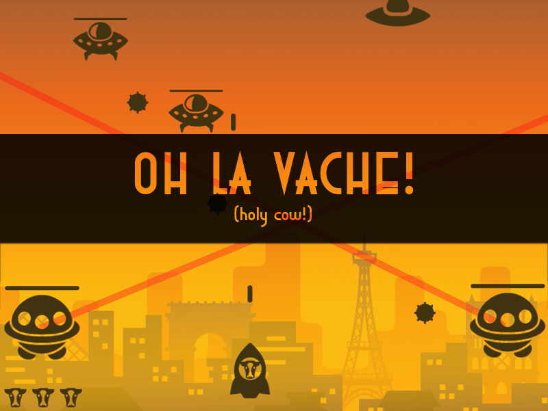

<h1 align="left">
  
</h1>

Help La Vache protect his city from the aliens! Move with the arrow keys and shoot with the spacebar. 

See a demo [here.](https://www.youtube.com/watch?v=NpaKdOW1ymc)

## How to run program

* Download this repository as a zip file
* Download and run [Qt Creator](https://www.qt.io/download)
* Open and run project file

## Built With

* [Qt](https://www.qt.io)
* C++
* Adobe Photoshop
* Adobe Illustrator

## About

* **Author:** *Chris Loreta* - [Loretac](https://github.com/Loretac)
* **Attributions:** See a the [ATTRIBUTIONS.md](ATTRIBUTIONS.md) file.
* **License:** This project is licensed under the MIT License. See the [License](LICENSE) file.

## Acknowledgments

* Based on tutorial from [Abdullah Aghazadah](https://www.youtube.com/channel/UClzV7jGJREjvCTzfGTrdrkQ)
